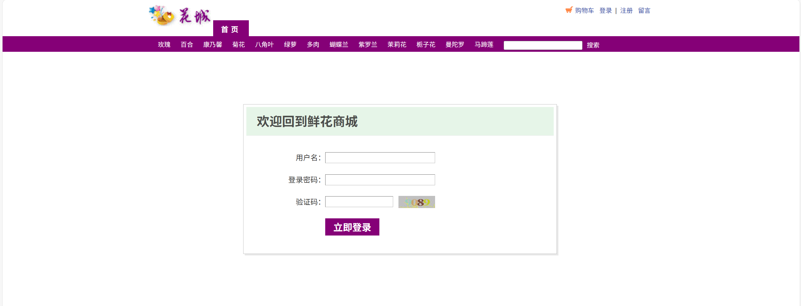
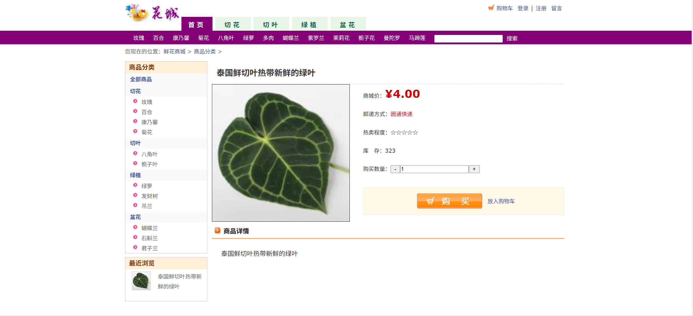
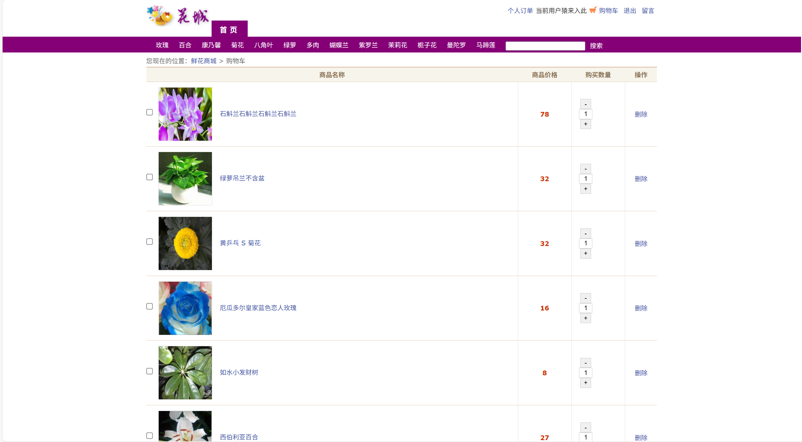
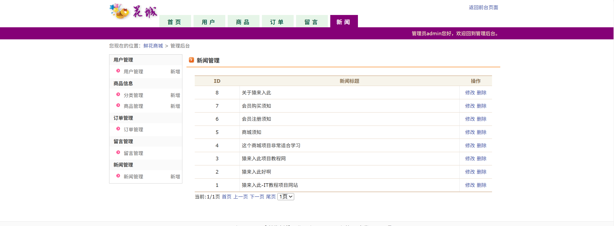
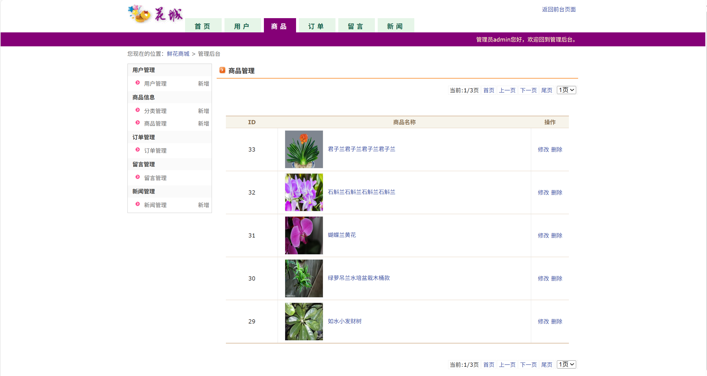
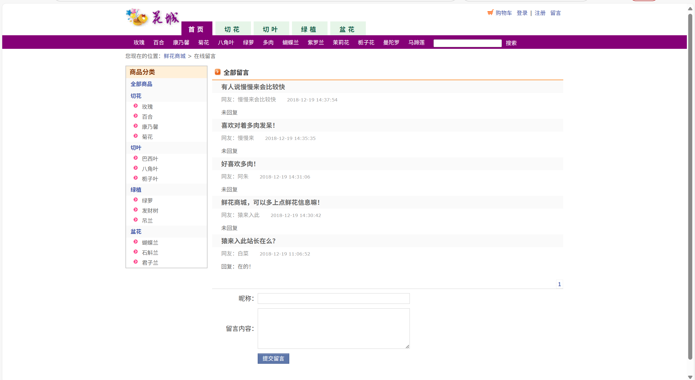
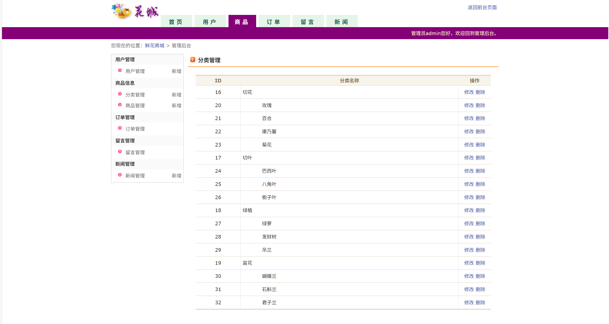

# jspServlet009
jspServlet009鲜花商城花店系统+BG
 
## 查看主页获取源码

### 一、关键词
鲜花商城系统，鲜花花店系统

### 二、作品包含
源码+数据库+设计报告文档+全套环境和工具资源+本地部署教程

### 三、项目技术
前端技术：Html、Css、Js、Jquery、Bootstrap
后端技术：Java、JSP、Servlet、JDBC

### 四、运行环境（以下版本亲测，其他版本兼容性请自行测试）
开发工具：IDEA/eclipse

数据库：MySQL5.7或8.0

服务器：Tomcat8.5或Tomcat9.0

数据库管理工具：Navicat10以上版本

环境配置软件： JDK1.8

浏览器：谷歌浏览器

### 五、项目介绍
项目编号：jspServlet009

随着互联网突飞猛进的发展及其对人们的生活产生至关重要的影响，线上购花，送货到家的购物方式受到了越来越多顾客的接受与喜爱。线上花卉小铺的设计与实现不仅可以带来更广泛的选择与实惠的价格，提供便利且优质的服务，而且可以更高效地宣传种植培养经验、花束的花语等花卉的相关知识，提高大家的文化素养，丰富精神世界。

系统用户端部分的功能设计大致分为三个模块：用户中心模块、购物车模块和个人订单管理模块。
用户中心模块功能有：1.用户的注册登录。2.个人信息的修改。3.从分类检索、关键字搜索查询、热销鲜花鲜花和折扣鲜花鲜花四个渠道来浏览鲜花鲜花相关信息。4.管理收藏。5.查看公告。6.店铺留言反馈问题。
购物车模块的功能有：1.对购物车中的鲜花鲜花进行增删改查。2.去结算功能。
个人订单管理模块功能有：1.对结算后的订单进行增删改查。2.查看各订单的状态，包括已取消、待发货、待收获、已收货。3.去评价功能。

系统管理员端功能设计大致分为四个模块：鲜花鲜花内容管理模块、鲜花鲜花订单管理模块、消息管理模块、用户管理模块。
鲜花鲜花内容管理模块功能有：1.对鲜花鲜花信息的增删改查。2.对鲜花鲜花类目的增删改查。3.鲜花鲜花的销量统计。
鲜花鲜花订单管理模块功能有：1.用户订单信息的增删改查。
消息管理模块功能有：1.对发布的活动公告进行增删改查。2.查看用户留言记录。
用户管理模块功能有：1.查看用户基本信息。2.按关键字查询用户。
### 六、运行截图

